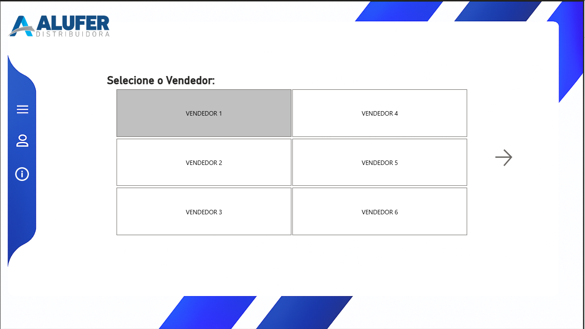
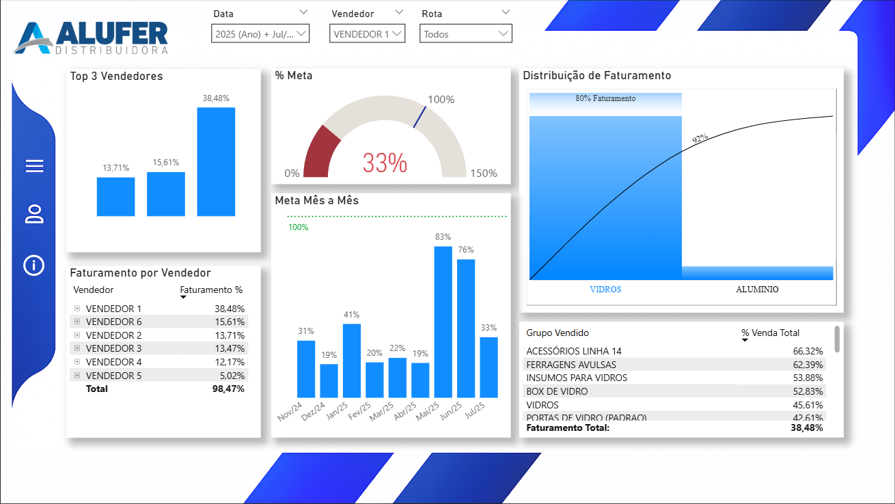
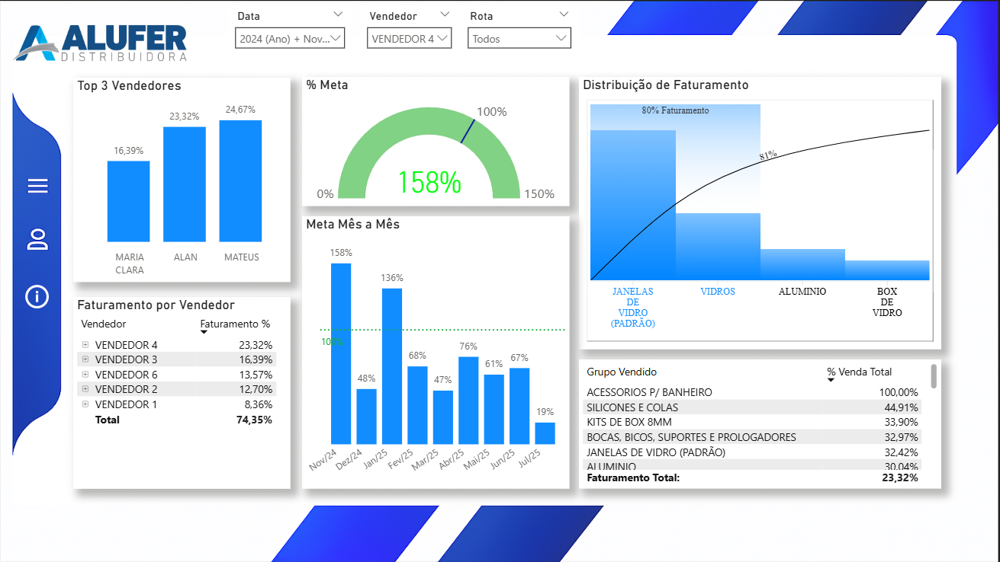
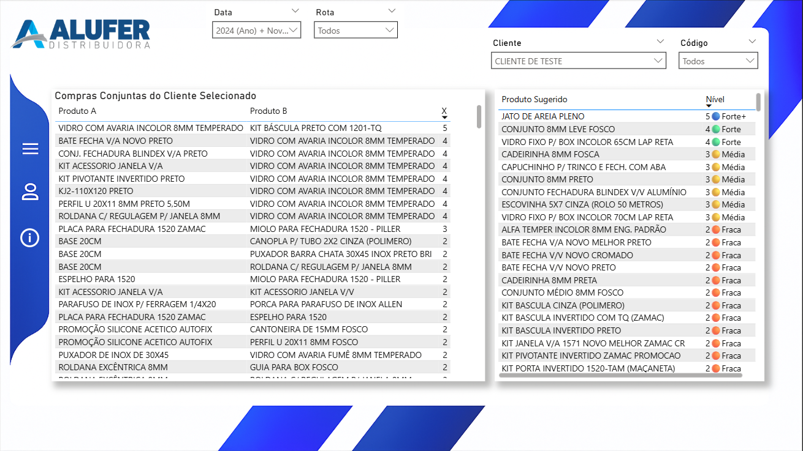
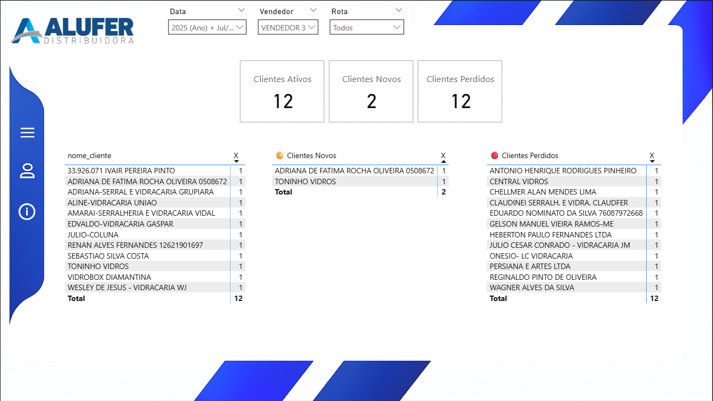

# 📊 Projeto Power BI - Vendas & Cross-Sell

Este projeto demonstra um pipeline completo de BI voltado para análise de vendas e oportunidades de vendas cruzadas (cross-sell), com foco em:

- Modelagem em estrela
- Sugestões de produtos com base em histórico
- Painéis visuais interativos no Power BI

---

## 🧭 Pipeline

1. **Recebimento de dados**
2. **Tratamento com Python (pandas)**
3. **Carga no PostgreSQL**
4. **Modelagem e visualização no Power BI**

---

## 📈 Dashboards

- Página **Geral**: Faturamento, % da meta, evolução mensal
- Página **Cross**: Produtos frequentemente vendidos juntos, sugestões por cliente

⚠️ *Os dados usados nos exemplos são fictícios ou truncados para fins de demonstração.*

---

## 📌 Tecnologias

- Power BI
- PostgreSQL
- Python (pandas)
- Power Query (M)
- DAX

---

## 📸 Visualizações do Projeto

### 1. Menu de Navegação



Tela inicial com navegação intuitiva para seleção do vendedor e acesso às demais análises. Interface amigável, limpa e objetiva.

---

### 2. Análise Geral de Vendas



Resumo executivo do desempenho comercial:

- **Top 3 Vendedores**
- **% da Meta** em destaque com gauge
- **Distribuição de Faturamento por Produto** seguindo o **Princípio de Pareto (80/20)**: foco nos itens que mais impactam o faturamento total.

---

### 3. Evolução de Vendas e Comparativo de Meta



Painel para análise temporal de performance:

- Comparativo mensal da meta x realizado
- Avaliação individual dos vendedores
- Agrupamento por **grupo de produto mais relevante**
- Destaque em verde quando o valor ultrapassa a meta (superação mensal)

---

### 4. Cross-Sell: Produtos e Sugestões



Painel baseado em vendas cruzadas:

- **Produtos frequentemente comprados em conjunto** (análise de afinidade)
- **Sugestões de novos produtos por cliente**, ranqueadas com nível de confiança (forte, média, fraca)
- Estratégia voltada a **aumentar ticket médio e retenção**

---

### 5. Clientes Ativos, Novos e Perdidos



Painel de **gestão de base de clientes**:

- Quantidade de **clientes ativos**, **novos** e **perdidos** no período
- Lista nominal para acompanhamento (anonimizada para esta versão pública)
- Permite ao time comercial monitorar a saúde da carteira e tomar ações corretivas

---

## 📁 Estrutura da Pasta de Imagens

Abaixo está a estrutura completa do projeto privado, destacando a separação clara entre dados, scripts, modelagem semântica e layout visual. Essa organização foi essencial para garantir escalabilidade, reuso e manutenção ao longo do tempo.

```plaintext
Alufer_pbi/
├── Dashboard/
│   ├── alufer.SemanticModel/
│   │   ├── model.bim                         # Modelo semântico Power BI
│   │   ├── definitions/                      # Medidas DAX e colunas calculadas
│   │   └── expressions/Section1.m            # Script M do Power Query
│   └── alufer.Report/Layout.json             # Layout visual do Power BI (tema, estrutura)
│
├── Dataset/
│   ├── Fevereiro_a_Abril.xlsx                # Relatórios originais do cliente
│   ├── Novembro_a_Janeiro.xlsx
│   ├── vendas_normalizadas_compilado.csv     # Arquivo final consolidado
│   └── vendas_normalizadas_compilado-exemplo.xlsx # Versão reduzida para testes
│
├── Scripts/
│   ├── criar_tabelas.sql                     # Tabelas base (PostgreSQL)
│   ├── criar-atualizar_produtos-cross.sql   # Cross-sell geral e por cliente
│   ├── criar-tabela-sugestoes.sql           # Tabela com sugestões de venda
│   ├── DimCalendario_pt-BR.tmdl             # Modelo de calendário
│   └── ExcelNormalizer.ipynb                # Script Python para tratamento e unificação dos dados
│
├── Imagens/
│   └── modelo_dados.png                      # Diagrama do modelo estrela

